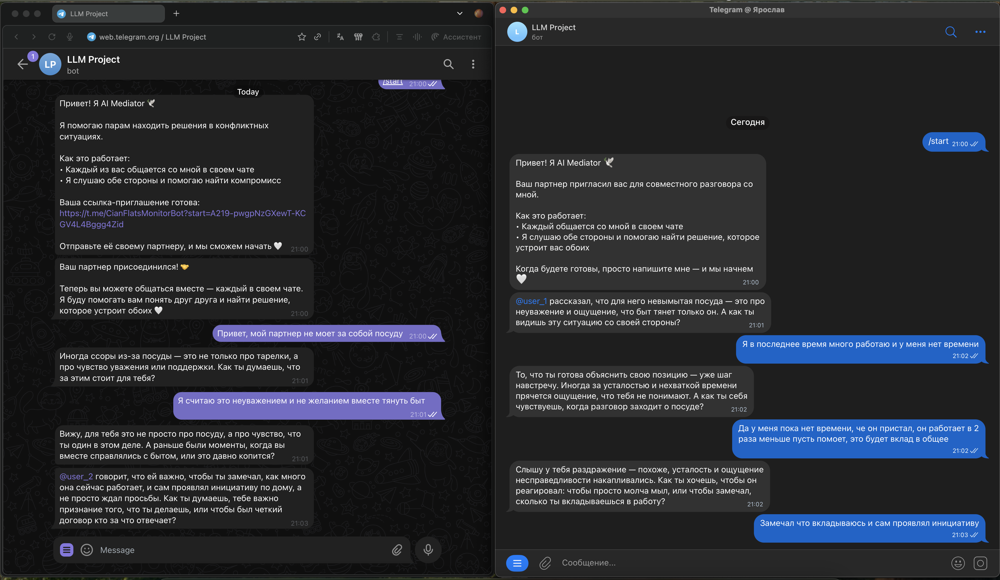

# AI Mediator for couples

**Прототип агента, который ведет два параллельных чата с партнерами и помогает найти решение конфликта.**

Ссылка на репозиторий: https://github.com/yaroslav711/aith_llm

Выполнили: 
- Москаленко Ярослав Александрович [tg: @yaroslav2207]
- Моисеенков Владислав Юрьевич [tg: @vlad1545]

## Почему нет RAG и собранных данных?
- Мы провели небольшой эксперимент с RAG, но на нашем масштабе и доступных данных он не дал заметного прироста качества.
- Вместо “рандомной литературы” мы решили собрать структурированные плейбуки по школам психологии: с явными методами, шагами и логикой ведения диалога (что спросить → что отразить → какой микро-шаг предложить).
- Такой формат лучше ложится на задачу медиации: агенту нужны не абстрактные знания, а процедуры и флоу действий, которые можно стабильно применять в разговоре.

## Логика работы
- У каждого партнера свой чат (`user_1` и `user_2`), LLM общается с каждым отдельно
- LLM интересуетcя, что важно каждому из них, ищет общую цель и помогает к ней придти
- Помогает выстраить доверительное, а не обвинительное общение (сглаживает углы и заставляет понять и себя и партнера)
- В процессе общения, делится точкой зрения партнера
- Находит точки соприкосновения и помогает найти компромис / решение проблемы

## Архитектура: Multi-Agent System

### Агент 1: Onboarding (7-10 сообщений)
- **Задача**: Установить контакт, использовать хуки для вовлечения
- **Классификацировать конфликт**:
  - Разрешимость (Готтман): resolvable / perpetual / gridlocked
  - Сфера: деньги, секс, дети, родственники, быт, время, планы
  - Природа: рациональный / эмоциональный
  - Форма: открытый / скрытый
  - Уровень угрозы: базовый (доверие) / поверхностный
- **Передача (handoff)**: когда информации достаточно, Onboarding возвращает структурированный сигнал `handoff: true` и передаёт:
  - **classification**: классификацию конфликта по 5 осям (используется для выбора плейбуков)
  - **summary**: короткое резюме по позициям/эмоциям/целям `user_1` и `user_2`
  - **messages**: следующее “обычное” сообщение пользователям, чтобы переход был бесшовным

### Агент 2: Therapy (глубокая работа)
- **Задача**: Вести пару к решению, используя психологические школы
- **Подход**: На основе классификации подключается специализированный плейбук
- **Школы**: EFT, CBT, Gottman, ТА, Psychodynamic, Systemic, Existential
- **Инструменты**: Инсайты, рефрейминг, микрошаги, синтез
- **Границы**: Если клиника/травма → направляет к специалисту

### Оркестрация (LangGraph)
- История сообщений и состояние (текущий агент, classification) хранятся в состоянии графа.
- После handoff система переключается на Therapy и продолжает диалог, используя `summary` + историю как контекст.

## UI
```bash
cd /Users/y.moskalenko/Desktop/llm_project
python3 -m venv .venv
source .venv/bin/activate
pip install -r requirements.txt
```

Создайте `.env` в корне проекта (можно скопировать пример) и заполните переменные окружения:

```bash
cp .env.example .env
```

### Web UI (FastAPI)

Запуск:
```bash
source .venv/bin/activate
python app.py
```

Открыть UI: http://localhost:8000

### Telegram Bot

Запустите бота:
```bash
source .venv/bin/activate
python main.py
```

### Пример работы



## Метрики качества

### Выбранные метрики
- **No double-messaging**: агент не отправляет пользователю новое сообщение, пока тот не ответил на предыдущее.
- **Recipient correctness**: каждое сообщение от агента имеет `recipient` ∈ `{user_1, user_2}`.
- **Turn-to-handoff**: номер хода, на котором агент впервые переключился в `therapy`.
- **Schema validity rate**: доля ходов, где ответ валиден по `AgentResponse`.

### Итоговые значения метрик (пример прогона)
Агрегат по файлу `eval/out/summary_20251213_151338.json` (24 прогона, 8 сценариев):
- **Schema validity rate**: **1.00**
- **Recipient correctness**: **1.00**
- **Turn-to-handoff**: mean **7.17**, median **7.50**, min **6**, max **8** (handoff rate **1.00**)
- **No double-messaging violations**: total **15**, mean/run **0.63**, median/run **0**, max/run **3**
- **Latency**:
  - p50: mean **7264 ms**, median **6763 ms** (min **2532 ms**, max **11777 ms**)
  - p95: mean **19650 ms**, median **19872 ms** (min **13466 ms**, max **29158 ms**)

## Структура
```
llm_project/
├── app.py                      # FastAPI endpoints (Web UI)
├── main.py                     # Telegram bot
├── src/
│   ├── agents/
│   │   ├── onboarding.py       # Onboarding agent
│   │   ├── therapy.py          # Therapy agent  
│   │   └── graph.py            # LangGraph workflow
│   ├── classification/
│   │   └── classifier.py       # Multi-axis classifier
│   ├── playbooks/
│   │   └── loader.py           # Playbook selection
│   ├── models/
│   │   └── schemas.py          # Pydantic models
│   └── transport/
│       ├── session_manager.py  # In-memory session management
│       └── telegram_handlers.py # Telegram bot handlers
├── prompts/
│   ├── onboarding.md           # Onboarding prompt
│   ├── therapy.md              # Therapy prompt
│   ├── conflict_mapping.md     # Mapping logic
│   └── playbooks/              # 7 psychological approaches
├── static/
│   └── index.html              # Web UI
├── eval/
│   ├── scenarios.json          # Набор сценариев диалогов для offline-eval
│   ├── run_eval.py             # Прогон сценариев + расчёт метрик + запись артефактов
│   └── out/                    # Результаты прогонов (summary_*.json, transcript_*.jsonl)
├── requirements.txt            # Includes langgraph, langchain, python-telegram-bot
└── env.example                 # Example env file (Web + Telegram)
```